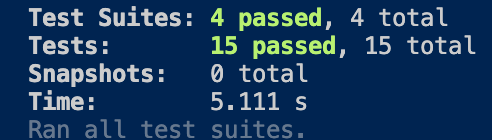

# Scooter App

## Date: 1/1/2022

### By:

### Jin Im Brancalhao

[GitHub](https://github.com/jinimbrancalhao) | [LinkedIn](https://www.linkedin.com/in/jinimb/)

---

**_Description_**

With charging stations all over and super low rates of 2 dollars per ride, Scooter App is the new best way to get around your city. Our scooters have a battery lasting 32km and maintenance personnel working hard to keep your scooters at peak condition. Get out and ride today!

---

**_Technologies Used_**

- JavaScript

---

**_Screenshots_**

Jest Tests

**_Future Updates_**

- [] Create GUI

---
